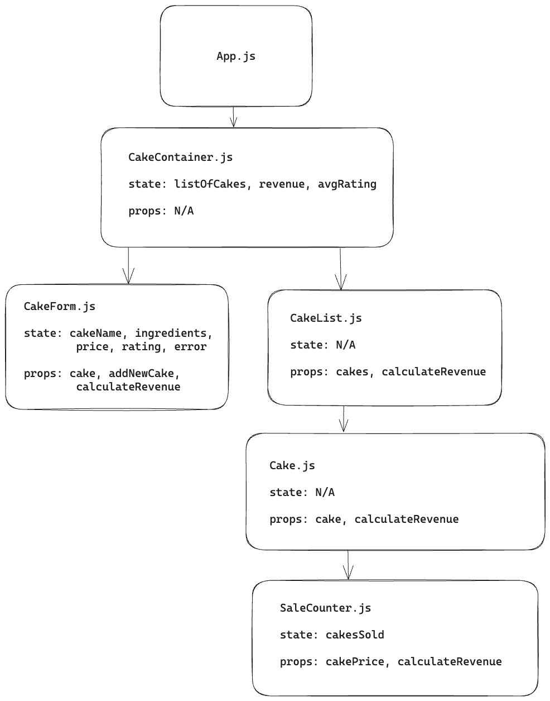

# Lab - The BNTA Bakery

## Component Diagram (Extensions)



In this exercise we're going to start building a React app. Ultimately the user will be able to see a range of cake recipes and be able to add their own. We have provided three cakes as your baseline below. This array has been already placed into state within the start code

```json
// listOfCakes

[
	{
		cakeName: "Victoria Sponge",
	   	ingredients: [
	   		"eggs",
	      	"butter",
	      	"sugar",
	      	"self-raising flour",
	      	"baking powder",
	      	"milk"
	  	],
	  	price: 5,
	   	rating: 5
	},
	{
	 	cakeName: "Tea Loaf",
	   	ingredients: [
	   		"eggs",
	      	"oil",
	      	"dried fruit",
	      	"sugar",
	      	"self-raising flour",
	      	"strong tea",
	  	],
	  	price: 2,
	  	rating: 3
	},
	{
	 	cakeName: "Carrot Cake",
	   	ingredients: [
	    	"carrots",
	      	"walnuts",
	      	"oil",
	      	"cream cheese",
	      	"flour",
	      	"sugar",
	   	],
	   	price: 8,
	   	rating: 5
	} 
]

```

Each cake has a name, a list of ingredients, a price and a rating.

## MVP

Your task is to build upon the start code to create a React app which displays all pieces of information for each cake

- Pass the information needed for each cake from the CakeContainer to each Cake as props
- Render the information passed down to Cake such as name and rating
- Ensure that the ingredients of each Cake are shown as a list

**Tips:**

- To access a specific object in an array, you can use square brackets and provide the index _e.g._ `listOfCakes[0]`
- You could make use a `map()` to loop over the cakes array, returning a component that takes in a cake object as a prop
- Remember that most of the usual JS rules appy, such as anonymous functions are NOT hoisted. This means the order in which you write your functions (and subsquently call them) will be important

## Extensions

The extension of this lab builds on the MVP by adding a form which will enable us to add a new cake to our list, which is automatically rendered

- Add a `CakeForm` component where the user can add details of a new cake. This will be rendered as part of the `CakeContainer`
- Build out functionality which takes the input of the form and adds a new cake to the `Cakes` array housed in state
- Modify the original `return` statement of the `CakeContainer` to instead `.map()` over the `Cakes` state object, creating an identical `Cake` component for each cake in the array
- Envision and code some functionality that makes use of the `price` or `rating` properties of each cake. Time to get creative!

**Tips:**

- Remember that you cannot directly modify state objects when using React, you need to make use of the relavent `SetState()` function
- For the ingredients list you can use a single text `input` field with the ingredients comma-separated. The `.split()` method will turn the single string from the input into an array of individual strings, for example:

```js
ingredients = "flour, eggs, sugar";

ingredients.split(", ");

// returns ["flour", "eggs", "sugar"]
```